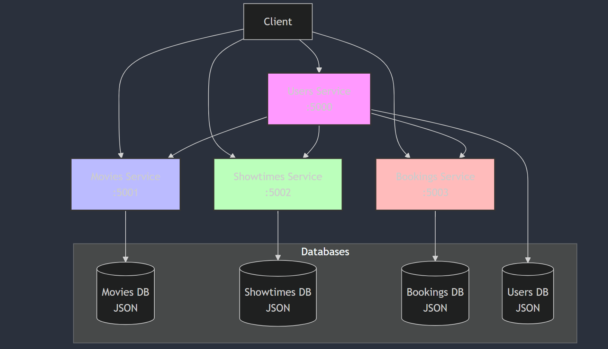
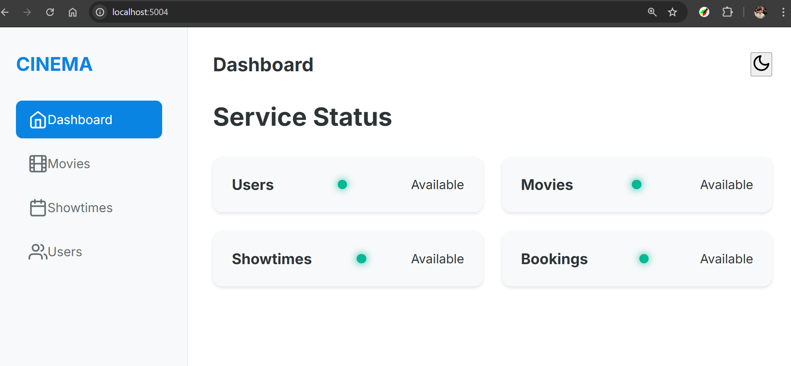

# Cinema 3 - Microservices in Python

A modern Python microservices example project for a movie theater system. The backend consists of 4 microservices built with Flask:

* **Movie Service** (port 5001): Movie information (ratings, title, etc.)
* **Show Times Service** (port 5002): Movie showing schedules
* **Booking Service** (port 5003): Booking information
* **Users Service** (port 5000): User information and movie suggestions

## Architecture Diagram


## Requirements

* Python 3.x
* pip (Python package installer)
* Linux/Unix environment (Ubuntu/Debian recommended)

## Installation

1. Clone the repository:
```bash
git clone <repository-url>
cd microservices
```

2. Install dependencies:
```bash
make install
```

## Running the Services

You have two options to run the services:

### Option 1: Run All Services at Once
```bash
make run-all
```

### Option 2: Run Services Individually
```bash
make run-movies     # Movies service on port 5001
make run-showtimes  # Showtimes service on port 5002
make run-bookings   # Bookings service on port 5003
make run-users      # Users service on port 5000
```

To stop all services:
```bash
make stop-all
```

## Testing the Services

You can test the services using curl commands or your web browser:

### 1. Movies Service (Port 5001)
```bash
# Get all movies
curl http://127.0.0.1:5001/movies

# Get specific movie
curl http://127.0.0.1:5001/movies/267eedb8-0f5d-42d5-8f43-72426b9fb3e6
```

### 2. Showtimes Service (Port 5002)
```bash
# Get all showtimes
curl http://127.0.0.1:5002/showtimes

# Get movies for a specific date
curl http://127.0.0.1:5002/showtimes/20151130
```

### 3. Bookings Service (Port 5003)
```bash
# Get all bookings
curl http://127.0.0.1:5003/bookings

# Get user bookings
curl http://127.0.0.1:5003/bookings/chris_rivers
```

### 4. Users Service (Port 5000)
```bash
# Get all users
curl http://127.0.0.1:5000/users

# Get user details
curl http://127.0.0.1:5000/users/chris_rivers

# Get movie suggestions for user
curl http://127.0.0.1:5000/users/chris_rivers/suggested
```

### UI Service (Port 5004)
The UI Service provides a modern web interface to interact with all other services.

#### Features:
- Service Status Dashboard
- Movie Catalog with Ratings
- Interactive Showtime Schedule
- User Management Interface
- Booking Management System

#### Endpoints:
- `GET /` - Dashboard showing all services status
- `GET /movies` - Browse movie catalog
- `GET /showtimes` - View movie schedules
- `GET /users` - User management
- `GET /bookings/<username>` - View user bookings

#### Screenshots:


## API Documentation

### Movie Service
- `GET /movies`: Returns a list of all movies
- `GET /movies/<movieid>`: Returns details for a specific movie

Example response:
```json
{
    "id": "267eedb8-0f5d-42d5-8f43-72426b9fb3e6",
    "title": "Creed",
    "director": "Ryan Coogler",
    "rating": 8.8
}
```

### Showtimes Service
- `GET /showtimes`: Returns all showtimes by date
- `GET /showtimes/<date>`: Returns movies playing on a specific date

Example response:
```json
{
    "20151130": [
        "267eedb8-0f5d-42d5-8f43-72426b9fb3e6",
        "7daf7208-be4d-4944-a3ae-c1c2f516f3e6"
    ]
}
```

### Bookings Service
- `GET /bookings`: Returns all bookings
- `GET /bookings/<username>`: Returns bookings for a specific user

Example response:
```json
{
    "chris_rivers": {
        "20151201": [
            "267eedb8-0f5d-42d5-8f43-72426b9fb3e6"
        ]
    }
}
```

### Users Service
- `GET /users`: Returns all users
- `GET /users/<username>`: Returns user details
- `GET /users/<username>/suggested`: Returns movie suggestions

Example response:
```json
{
    "id": "chris_rivers",
    "name": "Chris Rivers",
    "last_active": 1360031010
}
```

## Troubleshooting

1. If services fail to start, check if the ports are already in use:
```bash
sudo lsof -i :5000-5003
```

2. If you can't access the services, verify they're running:
```bash
ps aux | grep "python3 -m services"
```

3. To view service logs, check the terminal where you started the services

## Development Commands

Format code:
```bash
make format
```

Run linter:
```bash
make lint
```

Clean up cache files:
```bash
make clean
```

## Architecture

The services communicate with each other using REST APIs. The Users service aggregates data from other services to provide features like movie suggestions based on user booking history and movie ratings.
